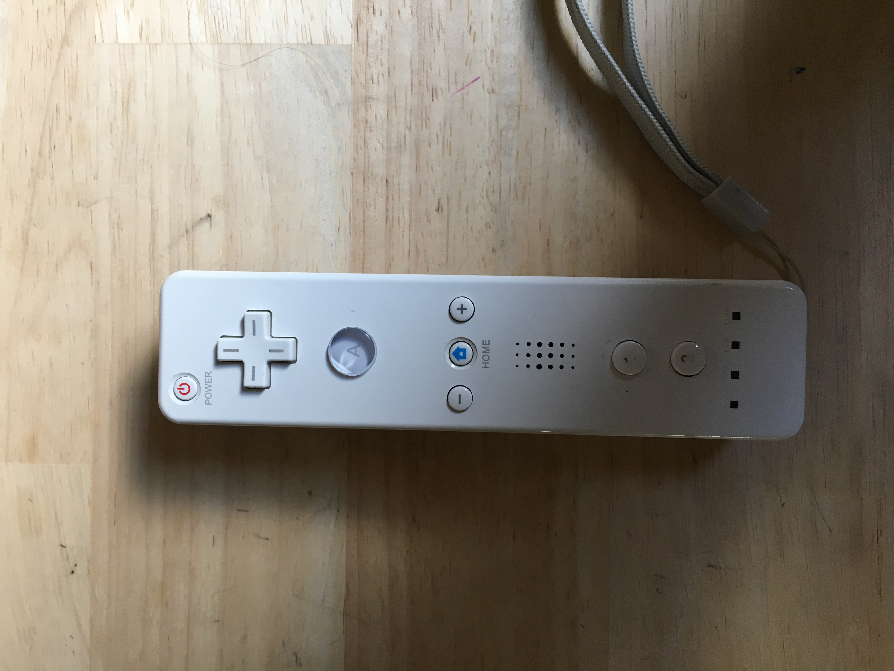
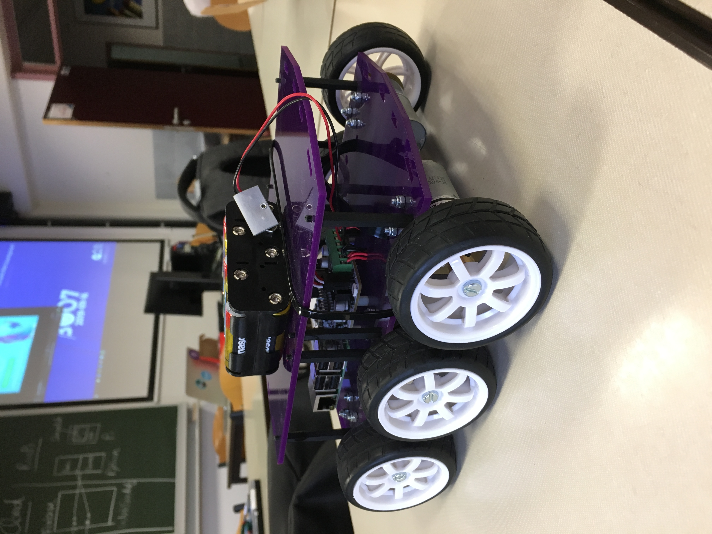

# Research Document - Jeroen Vervaeck en Yoram Platteeuw

## Controling Diddyborg with Wiimote

---

### Research rapport

We made instructions on how to set up and control the Diddyborg.

All the code can be found in the Research rapport.

/assets/docs/guideDiddyborg.md

---

### Components

we used these components in our guide:

- Diddyborg v2
- Raspberry Pi Camera v2
- Wiimote
- 10 AA batteries
- HDMI cable + Monitor
- Keyboard + mouse

---

### Example 1 - Driving Diddybborg

/examples/diddyDrive.py

### Example 2 - Contoling led on Thunderborg

/example/diddyLed.py

### Example 3 - Raspberry Pi Camera v2

/examples/diddySpy.py

### Example 4 - Combined projects

/examples/diddy.py

### Tool 1 - Get Key value from Wiimote

/tools/getKeys.py

### Tool 2 - Tunderborg library

/exaples/thunderBorg.py

---

### Outro

We had a lot of fun making the project. We are happy with how our Diddyborg turned out. We are able to take picures, control the led and drive it around, all with the Wiimote. 

---

#### Sources

[Piborg](https://www.piborg.org )

[Piborg Install guide](https://www.piborg.org/blog/build/rpi-ps3-help)

[Diddyborg store](https://www.piborg.org/robots/diddyborg-v2)

[Wiimote connection](https://www.instructables.com/id/Wiimote-Controller-Configuration-for-Raspberry-Pi-/)

[Thunderborg library](https://www.piborg.org/blog/thunderborg-getting-started)

[Bluethoot connection](https://core-electronics.com.au/tutorials/using-usb-and-bluetooth-controllers-with-python.html)

[Auto connection Bluethoot](https://www.instructables.com/id/Auto-Connection-of-the-Bluetooth-and-Auto-Running-/)

[Setup Bluethoot on Wiimote](https://pimylifeup.comraspberry-pi-wiimote-controllers/)

[Run program on boot](https://www.dexterindustries.com/howto/run-a-program-on-your-raspberry-pi-at-startup/)

[ls Input](https://raspberrypi.stackexchange.com/questions/71040/how-to-know-which-file-in-dev-input-event-represent-for-touch-input-device)

