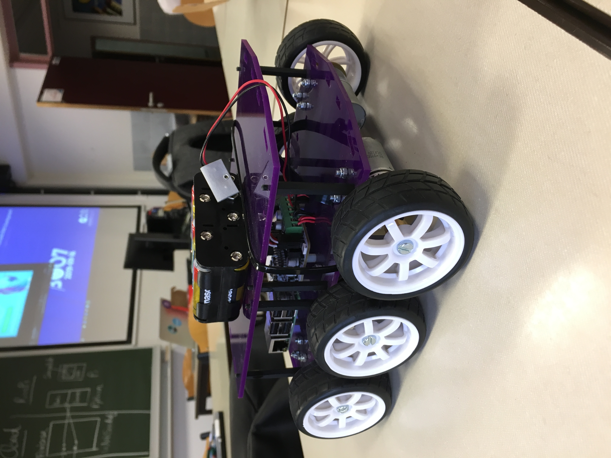
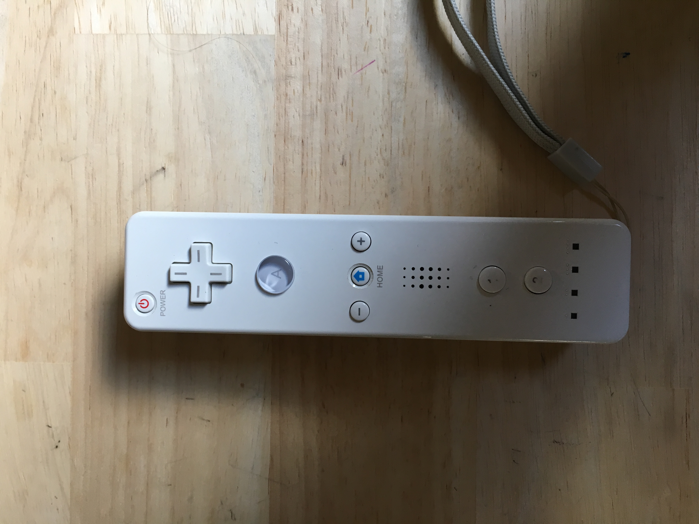

# Research rapport

## Controlling Diddyborg v2 with a Wiimote - Jeroen Vervaeck en Yoram Platteeuw

## Table of content

1. Intro

2. Diddyborg inisalising

3. Installing the ThunderBorg

4. Connecting Wii controller with Raspberry Pi

5. Mapping Wiimote input with python

6. Adressing Thunderborg

7. Starting program on boot

8. Applications 

9. Sources

### 1. Intro

The **Diddyborg v2** is a robot kit from PiBorg. It is a mount which is controlled by six motors. The power comes from AA batteries. It is possible to attach extra tools to the robot to make it more functional. We added a camera to our Diddyborg to make it more functional.

### 2. Diddyborg inisalising

**step 1**

Connect the Raspberry Pi from the Diddyborg to a screen (Or via SSH). Make sure the SD cart contains the newest version of Raspbian.

**Step 2**

Connect the battery pack to the Thunderborg. This will start up the RaspberryPi and Thunderborg.

**Step 3**

Connect the HDMI cable to a screen.

A keyboard and mouse to control the RaspberryPi are also recommended.




### 3. Installing the ThunderBorg:

**DiddyBorg v2** uses a [**ThunderBorg**](https://www.piborg.org/thunderborg) to drive the motors. We will connect the board later, for now we simply need to install the software to control it. **DiddyBorg** requires **I2C** to be enabled. If you have not done this before you can do this by:

Enter the following command in a terminal: `sudo raspi-config`

Move down to option 5 Interfacing Options and press ENTER

Move down to **option P5 I2C** and press ENTER

Make sure  **Yes**  is highlighted and press ENTER

When the dialog says **I2C is enabled** press ENTER

Move right until  **Finish**  is highlighted, then press ENTER

---

To run through the automatic installer just use this one line in a terminal:

`bash \&lt;(curl_ [_https://www.piborg.org/installer/install-diddyborg-v2.txt_](https://www.piborg.org/installer/install-diddyborg-v2.txt)_)`

---

If you would prefer to manually run through the steps use the commands below:

`mkdir ~/thunderborg`

`cd ~/thunderborg`

`wget http://www.piborg.org/downloads/thunderborg/examples.zip`

`unzip examples.zip`

`chmod +x install.sh`

`./install.sh`

`mkdir ~/diddyborgv2`

`cd ~/diddyborgv2`

`wget http://www.piborg.org/downloads/diddyborgv2/examples.zip`

`unzip examples.zip`

`chmod +x install.sh`

`./install.sh`

Once you have done this you will have two sets of examples:

ThunderBorg examples in _~/thunderborg_ The basic motor output and LED control examples will have links on the desktop

DiddyBorg v2 examples in _~/diddyborgv2_ This includes some standard examples such as remote control using a gamepad or joystick

This step will download some files to the RaspberryPi. They will be used later on.

## 4. Connecting Wii controller with Raspberry Pi

[https://www.instructables.com/id/Wiimote-Controller-Configuration-for-Raspberry-Pi-/](https://www.instructables.com/id/Wiimote-Controller-Configuration-for-Raspberry-Pi-/)

Update the existing software on your Raspberry Pi. We will be using the Linux Command line to perform all of the commands.

`sudo apt-get update`

`sudo apt-get upgrade`

---

The packages &quot;cwiid&quot; and &quot;wminput&quot; were created to interface the Wiimote and Raspberry Pi via bluetooth. The &quot;cwiid&quot; package is the Linux to Nintendo Wiimote interface. The &quot;wminput&quot; is a Linux event, mouse, and joystick driver for the wiimote using the uinput system.

`sudo apt-get install python-cwiid`

`sudo apt-get install wminput`

---

We need to change the udev rules so the uinput device will work with non-root users. We will do this by adding wiimote.rules to /etc/udev/rules.d.

`sudo nano /etc/udev/rules.d/wiimote.rules`

Copy and paste the following into the file. Then save this file.

`KERNEL==&quot;uinput&quot;, MODE=&quot;0666&quot;`

---

In order to implement the changes that you made to the rules file, you must either reboot the Raspberry Pi or restart the udev service.

`sudo shutdown -r now`

---

We will be using bluetooth to connect to the Wiimotes. Check the status by typing the following:

`/etc/init.d/bluetooth status`


---

**Configuring Wiimote Buttons in Wminput.**

Each Wiimote will need its own controller mapping. My configuration file will have controller mappings for the Wiimote and Nunchuk Buttons.

Create the file with the following command:

`sudo nano /home/pi/mywinput`

Next, Copy and paste this into the file:

```python
#WiiMote

Wiimote.A  = BTN\_A

Wiimote.B = BTN\_B

Wiimote.Dpad.X = ABS\_Y

Wiimote.Dpad.Y = -ABS\_X

Wiimote.Minus = BTN\_SELECT

Wiimote.Plus = BTN\_START

Wiimote.Home = BTN\_MODE

Wiimote.1 = BTN\_X

Wiimote.2 = BTN\_Y

# Nunchuk

Nunchuk.C = BTN\_C

Nunchuk.Z = BTN\_Z
```

---

**Activate the LED&#39;s on the Wiimote**

The Wiimote will work without this step, but if you would like to see that your Wiimote is connected or which controller mapping is currently mapped to that Wiimote, follow this step.

Add the following to the bottom of the file you just created:
```python
sudo nano /home/pi/myinput

Plugin.led.Led1 = 1

#Plugin.led.Led2 = 1

#Plugin.led.Led3 = 1

#Plugin.led.Led4 = 1
```

Remove the &quot;# &quot; on the line for the LED&#39;s you want to light up. You can go from no LED&#39;s lit to all LED&#39;s lit to everything in between.

---

**Get Wiimote Addresses**

Scan for Wiimotes by typing:

`hcitool scan`


This will give you an address in form: XX:XX:XX:XX:XX:XX

**Keep the address for later.**

---

**Create a Shell Script to Connect the Wiimotes**

Now we need to create a script that will connect the Wiimotes when we run it.

Create a directory and file for the script.

Make a directory by typing:

`mkdir /home/pi/bin`

Create the file by typing:

`sudo nano /home/pi/bin/connectwii.sh`

Copy and paste this into the file:

```
#!/bin/bash
sleep 1 # Wait until Bluetooth services are fully initialized

hcitool dev | grep hci /dev/null

if test $? -eq 0 ; then

wminput -d -c  /home/pi/mywminput 00:19:1D:48:D8:FD 

wminput -d -c  /home/pi/mywminput 00:22:D7:C2:A6:B9

else

echo "Blue-tooth adapter not present!";

exit 1

fi
```

Note: you need a wminput line for each wiimote you are using.

Replace the addresses above with the addresses of your wiimotes.

If you have different controller mappings for different Wiimotes, replace &quot;mywminput&quot; with your controller mapping.

**Make the script just created executable by typing:**

`sudo chmod 775 /home/pi/connectwii.sh`

---

Reboot your Raspberry Pi and test your script

`sudo shutdown –r now`

`sudo modprobe uinput`

`/home/pi/connectwii.sh`

---

**Reconnect Wiimode to Bluetooth on RaspberryPi**

When you need to reconnect the Wiimote to the RaspberryPi, you need to use the sync button on the back of the Wiimote.


---

**Test the Wiimote**

Install jstest-gtk to test your Wiimote as a controller.

`sudo apt-get install jstest-gtk`

`jstest-gtk`


You should see an interface that shows all valid inputs to test.

Select the device named 'Nintendo Wiimote'.

Press the buttons to see the Button Presses Register. In the picture, I am pressing the A button. You can see it register because the &quot;Buttons 4&quot; box transitions from white to black.

The Wiimote is configured!

### 5. Mapping Wiimote input with python

[https://core-electronics.com.au/tutorials/using-usb-and-bluetooth-controllers-with-python.html](https://core-electronics.com.au/tutorials/using-usb-and-bluetooth-controllers-with-python.html)


Every controller has different codes for their buttons.

First, we will need to write a code to see the bulk information about a buttonpress.

This first script will print all of the data to the shell, so be sure to make a note of the event codes and types for each button:

```python
#import evdev

from evdev import InputDevice, categorize, ecodes

#creates object gamepad to store the data

#you can call it whatever you like

wait = True

while wait:

gamepad = InputDevice('/dev/input/event#') #this event will have a different number when you reconnect

wait = False

except:

print(“waiting for wii remote to connect…”)

time.sleep(5)

#prints out device info at start

print(gamepad)

#evdev takes care of polling the controller in a loop

for event in gamepad.readloop():

print(categorize(event))
```

In the line "event at ##########.#####, **code ##**, type ##, val #####."


The part you will need is the **code**. Every button has a different code. So by pressing every button on your Wiimote, the corresponding code will appear. Take notes of the pressed button and their code. In the next step you will need them.

---

This code will print the pressed button to the shell. You will need to fill in your code number with the corresponding button:

```python
#import evdev

from evdev import InputDevice, categorize, ecodes

#creates object 'gamepad'; to store the data

#you can call it whatever you like

wait = True

while wait:

gamepad = InputDevice('/dev/input/event#') #this event will have a different number when you reconnect

wait = False

except:

print(“waiting for wii remote to connect…”)

time.sleep(5)

#button code variables (change to suit your device)

aBtn = ##

up = ##
down = ##
left = ##
right = ##

#prints out device info at start

print(gamepad)

#loop and filter by event code and print the mapped label

for event in gamepad.read\_loop():

if event.type == ecodes.EV\_KEY:

if event.value == 1:

if event.code == aBtn:

print('A')

elif event.code == up:

print('up')

elif event.code == down:

print('down')

elif event.code == left:

print('left')

elif event.code == right:

print('right')
```


Now the buttons are mapped, and you are ready to script your Diddyborg! Let the fun begin!

---

### Be aware!

When you reconnect the Wiimote on a different moment, you need to check the path for the InputDevice(‘/dev/input.event#’). By entering the line of code in the Terminal:

`Sudo apt install input-utils`

`lsinput`

https://raspberrypi.stackexchange.com/questions/71040/how-to-know-which-file-in-dev-input-event-represent-for-touch-input-device

---

### 6. Adressing Thunderborg

[https://www.piborg.org/blog/thunderborg-getting-started](https://www.piborg.org/blog/thunderborg-getting-started)

The library from Thunderborg must be installed.

**install Library**

`mkdir ~/thunderborg`

`cd ~/thunderborg`

`wget http://www.piborg.org/downloads/thunderborg/examples.zip`

`unzip examples.zip`

`chmod +x install.sh`

`./install.sh`

In the snippet of code, we download the folder **examples.zip.** This folder contains the file **'Thunderborg.py'.** This file needs to **be copied to the root folder** of your project.


**Python Library**
```python
# Setup the library ready for use

import ThunderBorg                      # Load the library

TB = ThunderBorg.ThunderBorg()          # Create a board object

TB.Init()                               # Setup the board

# Setting motor speeds

TB.SetMotor1(power)                     # Set motor 1 speed – waarde tussen 0 en 1

TB.SetMotor2(power)                     # Set motor 2 speed – waarde tussen 0 en 1

TB.SetMotors(power)                     # Set speed of both motors

TB.MotorsOff()                          # Stop both motors

# Reading motor speeds

TB.GetMotor1()                          # Read motor 1 speed

TB.GetMotor2()                          # Read motor 2 speed

# Controlling the LED

TB.SetLed1(r, g, b)                     # Set the colour of the ThunderBorg LED (values from 0.0 to 1.0)

TB.GetLed1()                            # Read the colour of the ThunderBorg LED (values from 0.0 to 1.0)

TB.SetLed2(r, g, b)                     # Set the colour of the ThunderBorg Lid LED (values from 0.0 to 1.0)

TB.GetLed2()                            # Read the colour of the ThunderBorg Lid LED (values from 0.0 to 1.0)

TB.SetLeds(r, g, b)                     # Set the colour of both LEDs (values from 0.0 to 1.0)

# Battery monitoring

TB.SetLedShowBattery(enabled)           # Set if the LEDs reflect the current battery reading

TB.GetLedShowBattery()                  # Read if the LEDs reflect the current battery reading

TB.GetBatteryReading()                  # Read the current voltage level from the battery

TB.SetBatteryMonitoringLimits(min, max) # Set the limits for the LED based battery monitoring

TB.GetBatteryMonitoringLimits()         # Read the limits for the LED based battery monitoring

# Controlling the failsafe

TB.SetCommsFailsafe(enabled)            # Set if the communications failsafe is active

TB.GetCommsFailsafe()                   # Read if the communications failsafe is active

# Testing for faults

TB.GetDriveFault1()                     # See if there is a fault reported for M1

TB.GetDriveFault2()                     # See if there is a fault reported for M2

# RasPiO InsPiRing control

TB.SetExternalLedColours([[r,g,b], [r,g,b], [r,g,b], ..., [r,g,b]])

# Set the colour of each LED on the InsPiRing (values from 0.0 to 1.0)

# Setting parameters (before Init)

TB.i2cAddress = address                 # Set the address of the board to use

TB.printFunction = function             # Re-route / disable diagnostic messages

# Reading parameters (after Init)

print TB.busNumber                      # Shows which I²C bus the board is connected on

print TB.foundChip                      # See if the board is found / not found

# Other functions

ThunderBorg.ScanForThunderBorg()        # Sweep the I²C bus for available boards

ThunderBorg.SetNewAddress(address)      # Configure the attached board with a new address

TB.Help()                               # Get help on the available functions
```

### 7. Starting program on boot

[https://www.dexterindustries.com/howto/run-a-program-on-your-raspberry-pi-at-startup/](https://www.dexterindustries.com/howto/run-a-program-on-your-raspberry-pi-at-startup/)

All lines in rs.local get executed on boot:

`sudo nano /etc/rc.local`

To start diddy.py on boot add the line:

`sudo python PATH_TO_YOUR_FILE &`

Now the program will execute without entering a screen first.


### 8. Applications

https://www.raspberrypi.org/documentation/configuration/camera.md
https://picamera.readthedocs.io/en/release-1.13/recipes1.html


Connect the camera to the RaspberryPi. The camera is fragile so be careful handeling it.

We are going to make an example. If you press a button on the Wiimote, then the camera will take a picture of its vieuw.

First install the software for the camera to the RaspberyPi.

**Setting up the camera software**

Execute the following instructions on the command line to download and install the latest kernel, GPU firmware, and applications:

`sudo apt-get update`

`sudo apt-get upgrade`

Now you need to enable camera support using the raspi-config program you will have used when you first set up your Raspberry Pi:

`sudo raspi-config`

Use the cursor keys to move to the camera option and select **'enable'**. On exiting raspi-config, it will ask to reboot. The enable option will ensure that on reboot the correct GPU firmware will be running with the camera driver and tuning, and the GPU memory split is sufficient to allow the camera to acquire enough memory to run correctly.
To test that the system is installed and working, try the following command:

`raspistill -v -o test.jpg`

The display should show a five-second preview from the camera and then take a picture, saved to the file test.jpg, whilst displaying various informational messages.

Now we are going to implement this while connected to the Wiimote.

**Capturing to a file**

Create the folder **pictures** in your root folder of the project.

Capturing an image to a file is as simple as specifying the name of the file as the output of whatever capture() method you require:

```python
from time import sleep
from picamera import PiCamera

camera = PiCamera()
camera.resolution = (1024, 768)
camera.start_preview()

# Camera warm-up time
sleep(2)
camera.capture('pictures/foo.jpg')
```

Now the RaspberryPi will save 1 image to the the pictures folder.

The last step is to combine this code with the code from 'chapter 5 Mapping Wiimote input with python'

### 9. Sources

[https://www.piborg.org/blog/build/rpi-ps3-help](https://www.piborg.org/blog/build/rpi-ps3-help)

[https://www.piborg.org/robots/diddyborg-v2](https://www.piborg.org/robots/diddyborg-v2)

[https://www.instructables.com/id/Wiimote-Controller-Configuration-for-Raspberry-Pi-/](https://www.instructables.com/id/Wiimote-Controller-Configuration-for-Raspberry-Pi-/)

[https://www.piborg.org/blog/thunderborg-getting-started](https://www.piborg.org/blog/thunderborg-getting-started)

[https://core-electronics.com.au/tutorials/using-usb-and-bluetooth-controllers-with-python.html](https://core-electronics.com.au/tutorials/using-usb-and-bluetooth-controllers-with-python.html)

[https://www.instructables.com/id/Auto-Connection-of-the-Bluetooth-and-Auto-Running-/](https://www.instructables.com/id/Auto-Connection-of-the-Bluetooth-and-Auto-Running-/)

[https://pimylifeup.com/raspberry-pi-wiimote-controllers/](https://pimylifeup.com/raspberry-pi-wiimote-controllers/)

[https://www.dexterindustries.com/howto/run-a-program-on-your-raspberry-pi-at-startup/](https://www.dexterindustries.com/howto/run-a-program-on-your-raspberry-pi-at-startup/)

